# DIAGRAMA DE CASOS DE USO - SISTEMA NAPANCHITA

## Actores del Sistema

### 1. **Administrador**

- Acceso total al sistema
- Gestiona usuarios, productos, categorías, combos
- Toma pedidos (todos los tipos)
- Gestiona mesas y reservas
- Administra delivery y asigna repartidores
- Registra ventas y realiza cierre de caja
- Visualiza reportes y dashboard

### 2. **Mesero**

- Gestiona mesas y su estado
- Toma pedidos para mesas
- Registra reservas
- Consulta productos y disponibilidad

### 3. **Repartidor**

- Visualiza pedidos asignados
- Actualiza estado de entregas
- Marca pedidos como entregados

### 4. **Cliente Externo** (No accede al sistema)

- Llama/visita para hacer pedido
- Solicita reserva por teléfono
- Recibe delivery

---

## Casos de Uso por Módulo

### 📌 MÓDULO: AUTENTICACIÓN Y USUARIOS

**CU-001: Iniciar Sesión**

- **Actor:** Administrador, Mesero, Repartidor
- **Descripción:** El usuario ingresa sus credenciales para acceder al sistema
- **Precondición:** Usuario registrado en el sistema
- **Flujo Principal:**
  1. Usuario accede a la página de login
  2. Ingresa email y contraseña
  3. Sistema valida credenciales
  4. Sistema carga dashboard según rol
- **Flujo Alternativo:**
  - 3a. Credenciales incorrectas → Mostrar mensaje de error
  - 3b. Usuario inactivo → Mostrar mensaje y bloquear acceso

**CU-002: Gestionar Usuarios**

- **Actor:** Administrador
- **Descripción:** Administrador crea, modifica, lista o elimina usuarios del sistema
- **Precondición:** Sesión iniciada como administrador
- **Incluye:** Crear usuario, Modificar usuario, Eliminar usuario, Listar usuarios
- **Flujo Principal:**
  1. Administrador accede a módulo de usuarios
  2. Selecciona acción (crear/editar/eliminar)
  3. Completa formulario con datos requeridos
  4. Sistema valida información
  5. Sistema registra cambios
- **Flujo Alternativo:**
  - 4a. Email duplicado → Mostrar error
  - 4b. Datos inválidos → Mostrar mensajes de validación

**CU-003: Cerrar Sesión**

- **Actor:** Administrador, Mesero, Repartidor
- **Descripción:** El usuario cierra su sesión de forma segura
- **Flujo Principal:**
  1. Usuario hace clic en "Cerrar Sesión"
  2. Sistema destruye sesión
  3. Sistema redirige al login

---

### 📌 MÓDULO: PRODUCTOS Y CATEGORÍAS

**CU-004: Gestionar Categorías**

- **Actor:** Administrador
- **Descripción:** Administrador crea, modifica o elimina categorías de productos
- **Precondición:** Sesión iniciada como administrador
- **Flujo Principal:**
  1. Administrador accede a módulo de categorías
  2. Selecciona acción (crear/editar/eliminar/ordenar)
  3. Completa formulario
  4. Sistema valida y guarda cambios
- **Flujo Alternativo:**
  - 4a. Categoría con productos → No permitir eliminar

**CU-005: Gestionar Productos**

- **Actor:** Administrador
- **Descripción:** Administrador gestiona el catálogo de productos del menú
- **Precondición:** Categorías existentes
- **Flujo Principal:**
  1. Administrador accede a módulo de productos
  2. Selecciona acción (crear/editar/eliminar)
  3. Completa formulario (nombre, precio, categoría, imagen, disponibilidad)
  4. Sube imagen del producto (opcional)
  5. Sistema valida y guarda
- **Flujo Alternativo:**
  - 4a. Imagen muy grande → Comprimir o rechazar
  - 5a. Producto en pedidos → No permitir eliminar, solo desactivar

**CU-006: Gestionar Combos**

- **Actor:** Administrador
- **Descripción:** Administrador crea combos agrupando productos con precio especial
- **Precondición:** Productos existentes
- **Flujo Principal:**
  1. Administrador accede a módulo de combos
  2. Crea nuevo combo
  3. Define nombre, descripción y precio
  4. Selecciona productos incluidos
  5. Sistema calcula precio sugerido
  6. Administrador confirma y guarda
- **Flujo Alternativo:**
  - 4a. Productos no disponibles → Advertir pero permitir crear

**CU-007: Consultar Productos**

- **Actor:** Administrador, Mesero
- **Descripción:** Usuario busca y visualiza productos disponibles
- **Flujo Principal:**
  1. Usuario accede al catálogo
  2. Filtra por categoría (opcional)
  3. Busca por nombre (opcional)
  4. Sistema muestra productos disponibles

---

### 📌 MÓDULO: CLIENTES

**CU-008: Gestionar Clientes**

- **Actor:** Administrador
- **Descripción:** Registrar y gestionar información de clientes
- **Precondición:** Sesión iniciada
- **Flujo Principal:**
  1. Administrador accede a módulo de clientes
  2. Busca cliente existente o crea nuevo
  3. Completa datos (nombre, teléfono, email, direcciones)
  4. Guarda información
- **Flujo Alternativo:**
  - 2a. Cliente no existe → Crear nuevo registro
  - 4a. Teléfono duplicado → Advertir y confirmar

**CU-009: Buscar Cliente**

- **Actor:** Administrador, Mesero
- **Descripción:** Buscar cliente para asociar a pedido o reserva
- **Flujo Principal:**
  1. Usuario ingresa nombre o teléfono
  2. Sistema busca coincidencias
  3. Usuario selecciona cliente de la lista
- **Flujo Alternativo:**
  - 2a. No hay resultados → Opción de crear nuevo cliente

---

### 📌 MÓDULO: PEDIDOS

**CU-010: Crear Pedido para Mesa**

- **Actor:** Administrador, Mesero
- **Descripción:** Registrar pedido de cliente en mesa del restaurante
- **Precondición:** Mesa disponible u ocupada
- **Flujo Principal:**
  1. Usuario selecciona mesa
  2. Agrega productos/combos al pedido
  3. Especifica cantidades
  4. Agrega notas especiales (opcional)
  5. Sistema calcula total
  6. Confirma pedido
  7. Sistema cambia estado de mesa a "Ocupada"
  8. Sistema envía pedido a cocina
- **Flujo Alternativo:**
  - 2a. Producto no disponible → Mostrar advertencia
  - 6a. Total = 0 → No permitir confirmar

**CU-011: Crear Pedido de Delivery**

- **Actor:** Administrador
- **Descripción:** Registrar pedido para entrega a domicilio
- **Precondición:** Cliente con dirección registrada
- **Flujo Principal:**
  1. Administrador busca/crea cliente
  2. Selecciona dirección de entrega
  3. Sistema calcula costo de envío por zona
  4. Agrega productos al pedido
  5. Sistema calcula total (productos + envío)
  6. Confirma pedido
  7. Sistema registra pedido con estado "Pendiente"
- **Extiende:** CU-016 (Asignar Repartidor)

**CU-012: Crear Pedido Para Llevar**

- **Actor:** Administrador, Mesero
- **Descripción:** Registrar pedido para recoger en local
- **Flujo Principal:**
  1. Usuario solicita datos de contacto
  2. Agrega productos al pedido
  3. Sistema calcula total
  4. Confirma pedido
  5. Informa tiempo estimado de preparación
- **Flujo Alternativo:**
  - 2a. Cliente frecuente → Autocompletar datos

**CU-013: Visualizar Pedidos (Cocina)**

- **Actor:** Administrador
- **Descripción:** Ver todos los pedidos pendientes y en preparación
- **Precondición:** Sesión iniciada
- **Flujo Principal:**
  1. Usuario accede a vista de cocina
  2. Sistema muestra pedidos ordenados por tiempo
  3. Muestra estado de cada pedido
  4. Auto-actualiza cada 30 segundos
- **Incluye:** CU-014 (Actualizar Estado de Pedido)

**CU-014: Actualizar Estado de Pedido**

- **Actor:** Administrador
- **Descripción:** Cambiar estado del pedido según avance
- **Flujo Principal:**
  1. Usuario selecciona pedido
  2. Cambia estado (Pendiente → En preparación → Listo → Entregado)
  3. Sistema registra cambio con timestamp
  4. Sistema notifica cambio (opcional)
- **Flujo Alternativo:**
  - 2a. Estado = Cancelado → Solicitar motivo

**CU-015: Consultar Historial de Pedidos**

- **Actor:** Administrador
- **Descripción:** Ver historial completo de pedidos
- **Flujo Principal:**
  1. Administrador accede a historial
  2. Aplica filtros (fecha, estado, tipo, cliente)
  3. Sistema muestra lista de pedidos
  4. Administrador puede ver detalles de cada pedido

---

### 📌 MÓDULO: MESAS Y RESERVAS

**CU-016: Gestionar Mesas**

- **Actor:** Administrador
- **Descripción:** Configurar mesas del restaurante
- **Flujo Principal:**
  1. Administrador accede a configuración de mesas
  2. Crea/edita mesa (número, capacidad, posición)
  3. Sistema valida datos
  4. Guarda configuración
- **Flujo Alternativo:**
  - 3a. Número duplicado → Mostrar error

**CU-017: Visualizar Layout de Mesas**

- **Actor:** Administrador, Mesero
- **Descripción:** Ver mapa visual de mesas con sus estados
- **Flujo Principal:**
  1. Usuario accede a vista de mesas
  2. Sistema muestra layout visual
  3. Mesas coloreadas según estado:
     - Verde: Disponible
     - Rojo: Ocupada
     - Amarillo: Reservada
  4. Usuario puede hacer clic para ver detalles/tomar acción
- **Incluye:** CU-018 (Cambiar Estado de Mesa)

**CU-018: Cambiar Estado de Mesa**

- **Actor:** Administrador, Mesero
- **Descripción:** Actualizar estado de mesa manualmente
- **Flujo Principal:**
  1. Usuario selecciona mesa
  2. Cambia estado (Disponible/Ocupada/Reservada)
  3. Sistema valida cambio
  4. Sistema actualiza vista
- **Flujo Alternativo:**
  - 3a. Mesa con pedido activo → No permitir cambiar a disponible

**CU-019: Registrar Reserva**

- **Actor:** Administrador, Mesero
- **Descripción:** Registrar reserva de mesa para cliente
- **Precondición:** Mesas configuradas
- **Flujo Principal:**
  1. Usuario busca/crea cliente
  2. Selecciona fecha y hora
  3. Sistema muestra mesas disponibles
  4. Usuario selecciona mesa
  5. Ingresa número de personas y notas
  6. Sistema genera código de confirmación
  7. Sistema crea reserva con estado "Pendiente"
  8. Usuario comunica código al cliente
- **Flujo Alternativo:**
  - 3a. No hay mesas disponibles → Sugerir horarios alternativos
  - 4a. Capacidad insuficiente → Advertir pero permitir

**CU-020: Gestionar Reservas**

- **Actor:** Administrador, Mesero
- **Descripción:** Ver, confirmar, cancelar o completar reservas
- **Flujo Principal:**
  1. Usuario accede a calendario de reservas
  2. Filtra por fecha/estado
  3. Selecciona reserva
  4. Realiza acción (Confirmar/Cancelar/Completar)
  5. Sistema actualiza estado
- **Flujo Alternativo:**
  - 4a. Cliente llega → Completar reserva y crear pedido
  - 4b. Cliente no llega → Marcar como "No show"

**CU-021: Consultar Disponibilidad**

- **Actor:** Administrador, Mesero
- **Descripción:** Verificar disponibilidad de mesas para fecha/hora
- **Flujo Principal:**
  1. Usuario ingresa fecha, hora y personas
  2. Sistema verifica reservas existentes
  3. Sistema muestra mesas disponibles
  4. Usuario puede proceder a reservar

---

### 📌 MÓDULO: DELIVERY

**CU-022: Gestionar Zonas de Delivery**

- **Actor:** Administrador
- **Descripción:** Configurar zonas de entrega con costos
- **Flujo Principal:**
  1. Administrador accede a configuración de zonas
  2. Crea/edita zona (nombre, costo de envío)
  3. Sistema guarda configuración

**CU-023: Asignar Repartidor a Pedido**

- **Actor:** Administrador
- **Descripción:** Asignar delivery a repartidor disponible
- **Flujo Principal:**
  1. Administrador ve pedidos de delivery pendientes
  2. Selecciona pedido
  3. Ve lista de repartidores disponibles
  4. Asigna repartidor
  5. Sistema cambia estado a "Asignado"
  6. Sistema notifica a repartidor (opcional)
- **Flujo Alternativo:**
  - 3a. No hay repartidores → Poner en cola

**CU-024: Visualizar Pedidos Asignados (Repartidor)**

- **Actor:** Repartidor
- **Descripción:** Ver lista de pedidos asignados para entregar
- **Flujo Principal:**
  1. Repartidor inicia sesión
  2. Sistema muestra pedidos asignados
  3. Muestra dirección, teléfono, monto
  4. Repartidor selecciona pedido para ver detalles
- **Incluye:** CU-025 (Actualizar Estado de Delivery)

**CU-025: Actualizar Estado de Delivery**

- **Actor:** Repartidor, Administrador
- **Descripción:** Cambiar estado del delivery
- **Flujo Principal:**
  1. Usuario selecciona pedido
  2. Cambia estado (Asignado → En camino → Entregado)
  3. Si "Entregado": registra hora de entrega
  4. Sistema actualiza estado
- **Flujo Alternativo:**
  - 2a. Cliente no está → Marcar como "Intento fallido"

**CU-026: Consultar Historial de Deliveries**

- **Actor:** Administrador
- **Descripción:** Ver historial de entregas por repartidor o zona
- **Flujo Principal:**
  1. Administrador aplica filtros
  2. Sistema muestra lista de deliveries
  3. Puede exportar reporte

---

### 📌 MÓDULO: VENTAS Y CAJA

**CU-027: Registrar Venta**

- **Actor:** Administrador
- **Descripción:** Registrar pago de un pedido
- **Precondición:** Pedido en estado "Listo" o "Entregado"
- **Flujo Principal:**
  1. Administrador selecciona pedido
  2. Ingresa monto recibido
  3. Selecciona método de pago (Efectivo/Tarjeta/Yape/Plin)
  4. Aplica descuento (opcional)
  5. Sistema calcula cambio (si es efectivo)
  6. Sistema registra venta
  7. Sistema genera ticket/comprobante
- **Flujo Alternativo:**
  - 4a. Código de descuento → Validar y aplicar
  - 7a. Sin impresora → Mostrar ticket en pantalla

**CU-028: Generar Ticket/Comprobante**

- **Actor:** Sistema
- **Descripción:** Generar documento de venta
- **Flujo Principal:**
  1. Sistema toma datos de venta
  2. Genera PDF con formato de ticket
  3. Incluye: fecha, productos, precios, total, método de pago
  4. Permite imprimir o enviar por email

**CU-029: Realizar Cierre de Caja**

- **Actor:** Administrador
- **Descripción:** Cerrar caja al final del turno/día
- **Flujo Principal:**
  1. Administrador accede a cierre de caja
  2. Sistema muestra ventas del día
  3. Muestra totales por método de pago
  4. Administrador ingresa montos físicos contados
  5. Sistema calcula diferencias
  6. Administrador confirma cierre
  7. Sistema genera reporte de cierre
- **Flujo Alternativo:**
  - 5a. Hay diferencias → Registrar y solicitar justificación

**CU-030: Aplicar Descuentos**

- **Actor:** Administrador
- **Descripción:** Aplicar descuento a pedido o venta
- **Flujo Principal:**
  1. Administrador ingresa código o porcentaje
  2. Sistema valida descuento
  3. Sistema recalcula total
  4. Sistema registra descuento aplicado

---

### 📌 MÓDULO: REPORTES Y DASHBOARD

**CU-031: Visualizar Dashboard**

- **Actor:** Administrador
- **Descripción:** Ver métricas clave del negocio
- **Flujo Principal:**
  1. Administrador accede al dashboard
  2. Sistema muestra widgets con:
     - Ventas del día/semana/mes
     - Productos más vendidos (top 5)
     - Pedidos por estado
     - Ocupación de mesas
     - Gráficos de tendencias
  3. Administrador puede seleccionar período

**CU-032: Generar Reporte de Ventas**

- **Actor:** Administrador
- **Descripción:** Generar reporte detallado de ventas
- **Flujo Principal:**
  1. Administrador accede a reportes
  2. Selecciona tipo: Ventas
  3. Define período (fecha inicio - fecha fin)
  4. Aplica filtros (categoría, producto, método de pago)
  5. Sistema genera reporte
  6. Muestra gráficos y tablas
  7. Permite exportar a PDF/Excel

**CU-033: Generar Reporte de Productos**

- **Actor:** Administrador
- **Descripción:** Analizar rendimiento de productos
- **Flujo Principal:**
  1. Administrador selecciona reporte de productos
  2. Sistema muestra:
     - Productos más vendidos
     - Productos menos vendidos
     - Rentabilidad por categoría
     - Performance de combos
  3. Permite exportar

**CU-034: Generar Reporte de Delivery**

- **Actor:** Administrador
- **Descripción:** Analizar rendimiento de delivery
- **Flujo Principal:**
  1. Administrador selecciona reporte de delivery
  2. Define período
  3. Sistema muestra:
     - Pedidos por zona
     - Tiempo promedio de entrega
     - Rendimiento de repartidores
     - Zonas más rentables
  4. Muestra gráficos
  5. Permite exportar

**CU-035: Generar Reporte de Clientes**

- **Actor:** Administrador
- **Descripción:** Analizar comportamiento de clientes
- **Flujo Principal:**
  1. Administrador selecciona reporte de clientes
  2. Sistema muestra:
     - Clientes frecuentes
     - Ticket promedio por cliente
     - Preferencias de productos
     - Análisis de reservas
  3. Permite segmentar por período

**CU-036: Exportar Reportes**

- **Actor:** Administrador
- **Descripción:** Exportar reportes en diferentes formatos
- **Flujo Principal:**
  1. Administrador genera reporte
  2. Selecciona formato (PDF/Excel)
  3. Sistema genera archivo
  4. Descarga automáticamente

---

## Matriz de Casos de Uso por Actor

| Caso de Uso                               | Admin | Mesero | Repartidor |
| ----------------------------------------- | ----- | ------ | ---------- |
| CU-001: Iniciar Sesión                    | ✓     | ✓      | ✓          |
| CU-002: Gestionar Usuarios                | ✓     | -      | -          |
| CU-003: Cerrar Sesión                     | ✓     | ✓      | ✓          |
| CU-004: Gestionar Categorías              | ✓     | -      | -          |
| CU-005: Gestionar Productos               | ✓     | -      | -          |
| CU-006: Gestionar Combos                  | ✓     | -      | -          |
| CU-007: Consultar Productos               | ✓     | ✓      | -          |
| CU-008: Gestionar Clientes                | ✓     | -      | -          |
| CU-009: Buscar Cliente                    | ✓     | ✓      | -          |
| CU-010: Crear Pedido para Mesa            | ✓     | ✓      | -          |
| CU-011: Crear Pedido de Delivery          | ✓     | -      | -          |
| CU-012: Crear Pedido Para Llevar          | ✓     | ✓      | -          |
| CU-013: Visualizar Pedidos (Cocina)       | ✓     | -      | -          |
| CU-014: Actualizar Estado de Pedido       | ✓     | -      | -          |
| CU-015: Consultar Historial de Pedidos    | ✓     | -      | -          |
| CU-016: Gestionar Mesas                   | ✓     | -      | -          |
| CU-017: Visualizar Layout de Mesas        | ✓     | ✓      | -          |
| CU-018: Cambiar Estado de Mesa            | ✓     | ✓      | -          |
| CU-019: Registrar Reserva                 | ✓     | ✓      | -          |
| CU-020: Gestionar Reservas                | ✓     | ✓      | -          |
| CU-021: Consultar Disponibilidad          | ✓     | ✓      | -          |
| CU-022: Gestionar Zonas de Delivery       | ✓     | -      | -          |
| CU-023: Asignar Repartidor a Pedido       | ✓     | -      | -          |
| CU-024: Visualizar Pedidos Asignados      | ✓     | -      | ✓          |
| CU-025: Actualizar Estado de Delivery     | ✓     | -      | ✓          |
| CU-026: Consultar Historial de Deliveries | ✓     | -      | -          |
| CU-027: Registrar Venta                   | ✓     | -      | -          |
| CU-028: Generar Ticket/Comprobante        | ✓     | -      | -          |
| CU-029: Realizar Cierre de Caja           | ✓     | -      | -          |
| CU-030: Aplicar Descuentos                | ✓     | -      | -          |
| CU-031: Visualizar Dashboard              | ✓     | -      | -          |
| CU-032: Generar Reporte de Ventas         | ✓     | -      | -          |
| CU-033: Generar Reporte de Productos      | ✓     | -      | -          |
| CU-034: Generar Reporte de Delivery       | ✓     | -      | -          |
| CU-035: Generar Reporte de Clientes       | ✓     | -      | -          |
| CU-036: Exportar Reportes                 | ✓     | -      | -          |

---

## Diagrama Visual (Formato PlantUML)

```plantuml
@startuml
left to right direction

actor "Administrador" as Admin
actor "Mesero" as Mesero
actor "Repartidor" as Repartidor
actor "Cliente Externo" as Cliente

rectangle "Sistema de Gestión Napanchita" {

  package "Autenticación" {
    usecase "Iniciar Sesión" as UC1
    usecase "Gestionar Usuarios" as UC2
    usecase "Cerrar Sesión" as UC3
  }

  package "Productos" {
    usecase "Gestionar Categorías" as UC4
    usecase "Gestionar Productos" as UC5
    usecase "Gestionar Combos" as UC6
    usecase "Consultar Productos" as UC7
  }

  package "Clientes" {
    usecase "Gestionar Clientes" as UC8
    usecase "Buscar Cliente" as UC9
  }

  package "Pedidos" {
    usecase "Crear Pedido Mesa" as UC10
    usecase "Crear Pedido Delivery" as UC11
    usecase "Crear Pedido Para Llevar" as UC12
    usecase "Visualizar Pedidos Cocina" as UC13
    usecase "Actualizar Estado Pedido" as UC14
    usecase "Consultar Historial" as UC15
  }

  package "Mesas y Reservas" {
    usecase "Gestionar Mesas" as UC16
    usecase "Visualizar Layout Mesas" as UC17
    usecase "Cambiar Estado Mesa" as UC18
    usecase "Registrar Reserva" as UC19
    usecase "Gestionar Reservas" as UC20
  }

  package "Delivery" {
    usecase "Gestionar Zonas" as UC22
    usecase "Asignar Repartidor" as UC23
    usecase "Ver Pedidos Asignados" as UC24
    usecase "Actualizar Estado Delivery" as UC25
  }

  package "Ventas y Caja" {
    usecase "Registrar Venta" as UC27
    usecase "Generar Ticket" as UC28
    usecase "Cierre de Caja" as UC29
    usecase "Aplicar Descuentos" as UC30
  }

  package "Reportes" {
    usecase "Dashboard" as UC31
    usecase "Reporte Ventas" as UC32
    usecase "Reporte Productos" as UC33
    usecase "Reporte Delivery" as UC34
    usecase "Reporte Clientes" as UC35
    usecase "Exportar Reportes" as UC36
  }
}

' Relaciones Administrador
Admin --> UC1
Admin --> UC2
Admin --> UC3
Admin --> UC4
Admin --> UC5
Admin --> UC6
Admin --> UC7
Admin --> UC8
Admin --> UC9
Admin --> UC10
Admin --> UC11
Admin --> UC12
Admin --> UC13
Admin --> UC14
Admin --> UC15
Admin --> UC16
Admin --> UC17
Admin --> UC18
Admin --> UC19
Admin --> UC20
Admin --> UC22
Admin --> UC23
Admin --> UC24
Admin --> UC25
Admin --> UC27
Admin --> UC28
Admin --> UC29
Admin --> UC30
Admin --> UC31
Admin --> UC32
Admin --> UC33
Admin --> UC34
Admin --> UC35
Admin --> UC36

' Relaciones Mesero
Mesero --> UC1
Mesero --> UC3
Mesero --> UC7
Mesero --> UC9
Mesero --> UC10
Mesero --> UC12
Mesero --> UC17
Mesero --> UC18
Mesero --> UC19
Mesero --> UC20

' Relaciones Repartidor
Repartidor --> UC1
Repartidor --> UC3
Repartidor --> UC24
Repartidor --> UC25

' Relaciones Include/Extend
UC27 ..> UC28 : <<include>>
UC11 ..> UC23 : <<extend>>
UC13 ..> UC14 : <<include>>
UC17 ..> UC18 : <<include>>

@enduml
```

---

## Notas para la Tesis

### Para el Capítulo de Análisis:

1. **Identificación de Actores:** 4 actores principales (3 internos + 1 externo)
2. **Total de Casos de Uso:** 36 casos de uso
3. **Módulos:** 8 módulos funcionales
4. **Relaciones:** Include, Extend, Herencia

### Descripción Detallada por Caso de Uso:

Cada caso de uso incluye:

- Actor(es) participante(s)
- Descripción breve
- Precondiciones
- Flujo principal
- Flujos alternativos
- Postcondiciones (implícitas)

### Para Draw.io:

Puedes usar el código PlantUML en https://plantuml.com o recrear manualmente en Draw.io usando la matriz de casos de uso como referencia.

---

**Elaborado:** 16/11/2025  
**Versión:** 1.0
