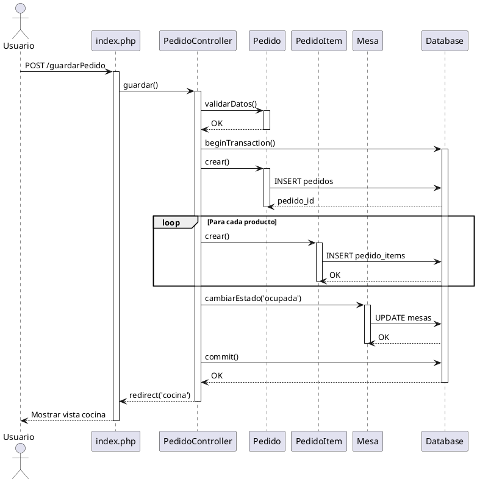

# DIAGRAMA DE CLASES - SISTEMA NAPANCHITA

## Diagrama UML Completo (Formato PlantUML)

```plantuml
@startuml

' ============================================
' CAPA DE CONFIGURACIÓN
' ============================================

class Database {
    - host: string
    - db_name: string
    - username: string
    - password: string
    - conn: PDO
    + getConnection(): PDO
}

' ============================================
' CAPA DE MODELOS
' ============================================

abstract class Model {
    # conn: PDO
    # table: string
    + __construct(db: PDO)
}

class Usuario {
    + id: int
    + nombre: string
    + email: string
    + password: string
    + telefono: string
    + rol: string
    + fecha_registro: timestamp
    + activo: boolean
    --
    + crear(): boolean
    + login(): boolean
    + obtenerPorId(id: int): array
    + listar(): PDOStatement
    + actualizar(): boolean
    + eliminar(id: int): boolean
    + cambiarPassword(nuevo_password: string): boolean
}

class Cliente {
    + id: int
    + nombre: string
    + telefono: string
    + email: string
    + direcciones: json
    + notas: text
    + fecha_registro: timestamp
    + activo: boolean
    --
    + crear(): boolean
    + obtenerPorId(id: int): array
    + listar(): PDOStatement
    + buscar(criterio: string): array
    + actualizar(): boolean
    + eliminar(id: int): boolean
    + agregarDireccion(direccion: array): boolean
}

class Categoria {
    + id: int
    + nombre: string
    + descripcion: text
    + orden: int
    + activo: boolean
    --
    + crear(): boolean
    + obtenerPorId(id: int): array
    + listar(): PDOStatement
    + listarActivas(): array
    + actualizar(): boolean
    + eliminar(id: int): boolean
    + actualizarOrden(orden: array): boolean
}

class Plato {
    + id: int
    + categoria_id: int
    + nombre: string
    + descripcion: text
    + precio: decimal
    + imagen_url: string
    + disponible: boolean
    + fecha_creacion: timestamp
    --
    + crear(): boolean
    + obtenerPorId(id: int): array
    + listar(): PDOStatement
    + listarPorCategoria(categoria_id: int): array
    + listarDisponibles(): array
    + buscar(criterio: string): array
    + actualizar(): boolean
    + eliminar(id: int): boolean
    + cambiarDisponibilidad(disponible: boolean): boolean
}

class Combo {
    + id: int
    + nombre: string
    + descripcion: text
    + precio: decimal
    + imagen_url: string
    + activo: boolean
    + fecha_creacion: timestamp
    --
    + crear(): boolean
    + obtenerPorId(id: int): array
    + obtenerConProductos(id: int): array
    + listar(): PDOStatement
    + listarActivos(): array
    + actualizar(): boolean
    + eliminar(id: int): boolean
    + agregarProducto(producto_id: int, cantidad: int): boolean
    + eliminarProducto(producto_id: int): boolean
}

class ComboProducto {
    + id: int
    + combo_id: int
    + producto_id: int
    + cantidad: int
    --
    + crear(): boolean
    + listarPorCombo(combo_id: int): array
    + eliminar(id: int): boolean
}

class Mesa {
    + id: int
    + numero: string
    + capacidad: int
    + estado: string
    + posicion_x: int
    + posicion_y: int
    + activo: boolean
    --
    + crear(): boolean
    + obtenerPorId(id: int): array
    + listar(): PDOStatement
    + listarDisponibles(): array
    + actualizar(): boolean
    + eliminar(id: int): boolean
    + cambiarEstado(estado: string): boolean
    + verificarDisponibilidad(fecha: date, hora: time): boolean
}

class Reserva {
    + id: int
    + cliente_id: int
    + mesa_id: int
    + fecha: date
    + hora: time
    + personas: int
    + estado: string
    + codigo_confirmacion: string
    + notas: text
    + creado_por_usuario_id: int
    + fecha_creacion: timestamp
    + fecha_actualizacion: timestamp
    --
    + crear(): boolean
    + obtenerPorId(id: int): array
    + obtenerPorCodigo(codigo: string): array
    + listar(): PDOStatement
    + listarPorFecha(fecha: date): array
    + listarPorEstado(estado: string): array
    + actualizar(): boolean
    + cambiarEstado(estado: string): boolean
    + cancelar(motivo: string): boolean
    + confirmar(): boolean
    + completar(): boolean
    + generarCodigoConfirmacion(): string
}

class Pedido {
    + id: int
    + cliente_id: int
    + mesa_id: int
    + usuario_id: int
    + tipo: string
    + estado: string
    + subtotal: decimal
    + costo_envio: decimal
    + descuento: decimal
    + total: decimal
    + notas: text
    + fecha_pedido: timestamp
    + fecha_actualizacion: timestamp
    --
    + crear(): boolean
    + obtenerPorId(id: int): array
    + obtenerConDetalles(id: int): array
    + listar(): PDOStatement
    + listarPorEstado(estado: string): array
    + listarPorTipo(tipo: string): array
    + listarPorMesa(mesa_id: int): array
    + listarPorCliente(cliente_id: int): array
    + actualizar(): boolean
    + cambiarEstado(estado: string): boolean
    + cancelar(motivo: string): boolean
    + calcularTotal(): decimal
}

class PedidoItem {
    + id: int
    + pedido_id: int
    + producto_id: int
    + combo_id: int
    + tipo: string
    + nombre: string
    + cantidad: int
    + precio_unitario: decimal
    + subtotal: decimal
    + notas: text
    --
    + crear(): boolean
    + obtenerPorPedido(pedido_id: int): array
    + actualizar(): boolean
    + eliminar(id: int): boolean
    + calcularSubtotal(): decimal
}

class ZonaDelivery {
    + id: int
    + nombre: string
    + descripcion: text
    + costo_envio: decimal
    + tiempo_estimado: int
    + activo: boolean
    --
    + crear(): boolean
    + obtenerPorId(id: int): array
    + listar(): PDOStatement
    + listarActivas(): array
    + actualizar(): boolean
    + eliminar(id: int): boolean
}

class Delivery {
    + id: int
    + pedido_id: int
    + direccion: text
    + referencia: text
    + zona_id: int
    + repartidor_id: int
    + estado: string
    + fecha_asignacion: timestamp
    + fecha_entrega: timestamp
    + observaciones: text
    --
    + crear(): boolean
    + obtenerPorId(id: int): array
    + obtenerPorPedido(pedido_id: int): array
    + listarPorRepartidor(repartidor_id: int): array
    + listarPorEstado(estado: string): array
    + actualizar(): boolean
    + asignarRepartidor(repartidor_id: int): boolean
    + cambiarEstado(estado: string): boolean
    + marcarEntregado(): boolean
}

class MetodoPago {
    + id: int
    + nombre: string
    + descripcion: string
    + activo: boolean
    --
    + crear(): boolean
    + obtenerPorId(id: int): array
    + listar(): PDOStatement
    + listarActivos(): array
    + actualizar(): boolean
}

class Venta {
    + id: int
    + pedido_id: int
    + metodo_pago_id: int
    + monto_recibido: decimal
    + monto_cambio: decimal
    + total: decimal
    + descuento_aplicado: decimal
    + codigo_descuento: string
    + usuario_id: int
    + fecha_venta: timestamp
    + ticket_generado: boolean
    --
    + crear(): boolean
    + obtenerPorId(id: int): array
    + obtenerPorPedido(pedido_id: int): array
    + listar(): PDOStatement
    + listarPorFecha(fecha_inicio: date, fecha_fin: date): array
    + listarPorMetodoPago(metodo_pago_id: int): array
    + calcularCambio(): decimal
    + generarTicket(): string
}

class CierreCaja {
    + id: int
    + usuario_id: int
    + fecha: date
    + hora_apertura: time
    + hora_cierre: time
    + monto_inicial: decimal
    + total_efectivo_sistema: decimal
    + total_efectivo_fisico: decimal
    + total_tarjeta: decimal
    + total_digital: decimal
    + total_ventas: decimal
    + diferencia: decimal
    + observaciones: text
    + fecha_cierre: timestamp
    --
    + crear(): boolean
    + obtenerPorId(id: int): array
    + obtenerPorFecha(fecha: date): array
    + listar(): PDOStatement
    + calcularTotales(): array
    + calcularDiferencia(): decimal
    + cerrar(): boolean
}

class Reporte {
    + conn: PDO
    --
    + ventasPorPeriodo(fecha_inicio: date, fecha_fin: date): array
    + ventasPorCategoria(periodo: string): array
    + productosTopVendidos(limite: int): array
    + productosPocoVendidos(limite: int): array
    + ventasPorMetodoPago(periodo: string): array
    + pedidosPorEstado(): array
    + pedidosPorTipo(periodo: string): array
    + deliveryPorZona(periodo: string): array
    + deliveryPorRepartidor(repartidor_id: int, periodo: string): array
    + tiempoPromedioEntrega(): float
    + clientesFrecuentes(limite: int): array
    + ticketPromedioPorCliente(): array
    + ocupacionMesas(fecha: date): array
    + reservasPorEstado(periodo: string): array
    + exportarPDF(datos: array): string
    + exportarExcel(datos: array): string
}

' ============================================
' CAPA DE CONTROLADORES
' ============================================

abstract class Controller {
    # db: PDO
    + __construct()
    # verificarSesion(): void
    # verificarRol(rol: string): boolean
    # redirect(url: string): void
    # json(data: array): void
}

class AuthController {
    - usuario: Usuario
    --
    + mostrarLogin(): void
    + login(): void
    + logout(): void
    + mostrarRegistro(): void
    + registro(): void
    + verificarSesion(): void
    + verificarAdmin(): void
    + verificarRol(rol: string): boolean
}

class UsuarioController {
    - usuario: Usuario
    --
    + index(): void
    + crear(): void
    + guardar(): void
    + editar(id: int): void
    + actualizar(): void
    + eliminar(id: int): void
    + cambiarEstado(id: int): void
}

class ClienteController {
    - cliente: Cliente
    --
    + index(): void
    + crear(): void
    + guardar(): void
    + editar(id: int): void
    + actualizar(): void
    + eliminar(id: int): void
    + buscar(criterio: string): void
    + agregarDireccion(): void
}

class PlatoController {
    - producto: Producto
    - categoria: Categoria
    --
    + index(): void
    + crear(): void
    + guardar(): void
    + editar(id: int): void
    + actualizar(): void
    + eliminar(id: int): void
    + cambiarDisponibilidad(id: int): void
    + buscar(criterio: string): void
    + subirImagen(): boolean
}

class ComboController {
    - combo: Combo
    - comboProducto: ComboProducto
    --
    + index(): void
    + crear(): void
    + guardar(): void
    + editar(id: int): void
    + actualizar(): void
    + eliminar(id: int): void
    + agregarProducto(): void
    + eliminarProducto(): void
}

class PedidoController {
    - pedido: Pedido
    - pedidoItem: PedidoItem
    --
    + index(): void
    + pos(): void
    + guardar(): void
    + detalle(id: int): void
    + cocina(): void
    + obtenerPendientes(): void
    + cambiarEstado(id: int, estado: string): void
    + cancelar(id: int): void
    + historial(): void
}

class MesaController {
    - mesa: Mesa
    --
    + index(): void
    + layout(): void
    + configurar(): void
    + guardar(): void
    + editar(id: int): void
    + actualizar(): void
    + eliminar(id: int): void
    + cambiarEstado(id: int, estado: string): void
}

class ReservaController {
    - reserva: Reserva
    - mesa: Mesa
    - cliente: Cliente
    --
    + index(): void
    + calendario(): void
    + crear(): void
    + guardar(): void
    + editar(id: int): void
    + actualizar(): void
    + confirmar(id: int): void
    + cancelar(id: int): void
    + completar(id: int): void
    + verificarDisponibilidad(): void
}

class DeliveryController {
    - delivery: Delivery
    - pedido: Pedido
    --
    + index(): void
    + vistaRepartidor(): void
    + asignarRepartidor(): void
    + cambiarEstado(id: int, estado: string): void
    + marcarEntregado(id: int): void
    + historial(): void
}

class VentaController {
    - venta: Venta
    - pedido: Pedido
    --
    + registrar(pedido_id: int): void
    + guardar(): void
    + historial(): void
    + detalle(id: int): void
    + generarTicket(id: int): void
}

class CierreCajaController {
    - cierreCaja: CierreCaja
    --
    + index(): void
    + abrir(): void
    + cerrar(): void
    + calcularTotales(): array
    + guardar(): void
    + historial(): void
    + detalle(id: int): void
}

class ReporteController {
    - reporte: Reporte
    --
    + dashboard(): void
    + ventas(): void
    + productos(): void
    + delivery(): void
    + clientes(): void
    + exportarPDF(): void
    + exportarExcel(): void
}

' ============================================
' RELACIONES DE HERENCIA
' ============================================

Model <|-- Usuario
Model <|-- Cliente
Model <|-- Categoria
Model <|-- Producto
Model <|-- Combo
Model <|-- ComboProducto
Model <|-- Mesa
Model <|-- Reserva
Model <|-- Pedido
Model <|-- PedidoItem
Model <|-- ZonaDelivery
Model <|-- Delivery
Model <|-- MetodoPago
Model <|-- Venta
Model <|-- CierreCaja

Controller <|-- AuthController
Controller <|-- UsuarioController
Controller <|-- ClienteController
Controller <|-- PlatoController
Controller <|-- ComboController
Controller <|-- PedidoController
Controller <|-- MesaController
Controller <|-- ReservaController
Controller <|-- DeliveryController
Controller <|-- VentaController
Controller <|-- CierreCajaController
Controller <|-- ReporteController

' ============================================
' RELACIONES DE ASOCIACIÓN
' ============================================

' Controladores usan Modelos
AuthController --> Usuario
UsuarioController --> Usuario
ClienteController --> Cliente
PlatoController --> Producto
PlatoController --> Categoria
ComboController --> Combo
ComboController --> ComboProducto
PedidoController --> Pedido
PedidoController --> PedidoItem
MesaController --> Mesa
ReservaController --> Reserva
ReservaController --> Mesa
ReservaController --> Cliente
DeliveryController --> Delivery
DeliveryController --> Pedido
VentaController --> Venta
VentaController --> Pedido
CierreCajaController --> CierreCaja
ReporteController --> Reporte

' Modelos se relacionan entre sí
Producto --> Categoria
Combo --> ComboProducto
ComboProducto --> Producto
Pedido --> Cliente
Pedido --> Mesa
Pedido --> Usuario
Pedido --> PedidoItem
PedidoItem --> Producto
PedidoItem --> Combo
Reserva --> Cliente
Reserva --> Mesa
Reserva --> Usuario
Delivery --> Pedido
Delivery --> ZonaDelivery
Delivery --> Usuario
Venta --> Pedido
Venta --> MetodoPago
Venta --> Usuario
CierreCaja --> Usuario

' Database es usado por todos
Controller --> Database
Model --> Database

@enduml
```



---

## Descripción de Clases Principales

### Clase Model (Abstracta)

**Propósito:** Clase base para todos los modelos con funcionalidad común

**Atributos:**

- `conn`: Conexión PDO a la base de datos
- `table`: Nombre de la tabla asociada

**Métodos:**

- `__construct(db)`: Constructor que recibe conexión a BD

---

### Clase Controller (Abstracta)

**Propósito:** Clase base para todos los controladores

**Métodos comunes:**

- `verificarSesion()`: Verifica que exista sesión activa
- `verificarRol()`: Verifica rol del usuario
- `redirect()`: Redirige a otra página
- `json()`: Retorna respuesta JSON

---

## Patrones de Diseño Aplicados

### 1. **Active Record**

Cada modelo representa una tabla y encapsula la lógica de acceso a datos.

```php
// Ejemplo uso de Active Record
$producto = new Plato($db);
$producto->nombre = "Ceviche Mixto";
$producto->precio = 25.00;
$producto->categoria_id = 1;
$producto->crear();
```

### 2. **Factory Pattern** (implícito en Database)

```php
$database = new Database();
$conn = $database->getConnection();
```

### 3. **Front Controller** (index.php)

Punto único de entrada que enruta todas las solicitudes.

### 4. **Dependency Injection**

```php
class PlatoController {
    public function __construct() {
        $database = new Database();
        $this->db = $database->getConnection();
        $this->producto = new Plato($this->db);
    }
}
```

---

## Diagrama de Secuencia - Crear Pedido



---

## Diagrama de Componentes

```
┌─────────────────────────────────────────────┐
│           FRONTEND (Navegador)              │
│  ┌───────────┐  ┌───────────┐             │
│  │   HTML    │  │    CSS    │             │
│  │  Views    │  │ Bootstrap │             │
│  └─────┬─────┘  └───────────┘             │
│        │                                    │
│  ┌─────┴────────┐  ┌───────────┐          │
│  │  JavaScript  │  │  Chart.js │          │
│  │    AJAX      │  │ DataTables│          │
│  └──────┬───────┘  └───────────┘          │
└─────────┼──────────────────────────────────┘
          │ HTTP
┌─────────┼──────────────────────────────────┐
│  ┌──────▼─────┐                            │
│  │  index.php │   Front Controller         │
│  └──────┬─────┘                            │
│         │                                   │
│  ┌──────▼──────────────────────────┐      │
│  │      CONTROLADORES              │      │
│  │  ┌────┐ ┌────┐ ┌────┐ ┌────┐   │      │
│  │  │Auth│ │Prod│ │Pedi│ │Repo│   │      │
│  │  └─┬──┘ └─┬──┘ └─┬──┘ └─┬──┘   │      │
│  └────┼──────┼──────┼──────┼───────┘      │
│       │      │      │      │               │
│  ┌────▼──────▼──────▼──────▼───────┐      │
│  │         MODELOS                  │      │
│  │  ┌────┐ ┌────┐ ┌────┐ ┌────┐    │      │
│  │  │User│ │Prod│ │Pedi│ │Vent│    │      │
│  │  └─┬──┘ └─┬──┘ └─┬──┘ └─┬──┘    │      │
│  └────┼──────┼──────┼──────┼────────┘      │
│       │      │      │      │                │
│  ┌────▼──────▼──────▼──────▼────────┐      │
│  │         DATABASE.PHP             │      │
│  │            PDO                   │      │
│  └──────────────┬───────────────────┘      │
└─────────────────┼──────────────────────────┘
                  │
┌─────────────────▼──────────────────────────┐
│           MySQL Database                   │
│  ┌────┐ ┌────┐ ┌────┐ ┌────┐ ┌────┐      │
│  │usu │ │cli │ │pro │ │ped │ │ven │      │
│  └────┘ └────┘ └────┘ └────┘ └────┘      │
└────────────────────────────────────────────┘
```

---

## Responsabilidades por Capa

### MODELOS (Models)

✅ Representar entidades del negocio
✅ Encapsular lógica de acceso a datos
✅ Validaciones de datos
✅ Queries SQL
❌ Lógica de presentación
❌ Procesamiento de formularios

### CONTROLADORES (Controllers)

✅ Procesar solicitudes HTTP
✅ Validar datos de entrada
✅ Coordinar modelos y vistas
✅ Lógica de negocio compleja
✅ Manejo de sesiones
❌ Queries SQL directas
❌ HTML directo

### VISTAS (Views)

✅ Presentación de datos
✅ Formularios HTML
✅ Interacción con JavaScript
❌ Lógica de negocio
❌ Acceso directo a base de datos

---

## Notas para la Tesis

### Diagramas a Incluir:

1. ✅ Diagrama de clases completo (este documento)
2. ✅ Diagrama de secuencia para operaciones críticas
3. ✅ Diagrama de componentes
4. Diagrama de paquetes (opcional)

### Justificación del Diseño:

- **Separación de responsabilidades:** MVC garantiza mantenibilidad
- **Herencia:** Reutilización de código en Model y Controller
- **Encapsulamiento:** Cada clase maneja su propia lógica
- **Bajo acoplamiento:** Modelos independientes entre sí
- **Alta cohesión:** Cada clase tiene un propósito claro

---

**Elaborado:** 16/11/2025  
**Versión:** 1.0
